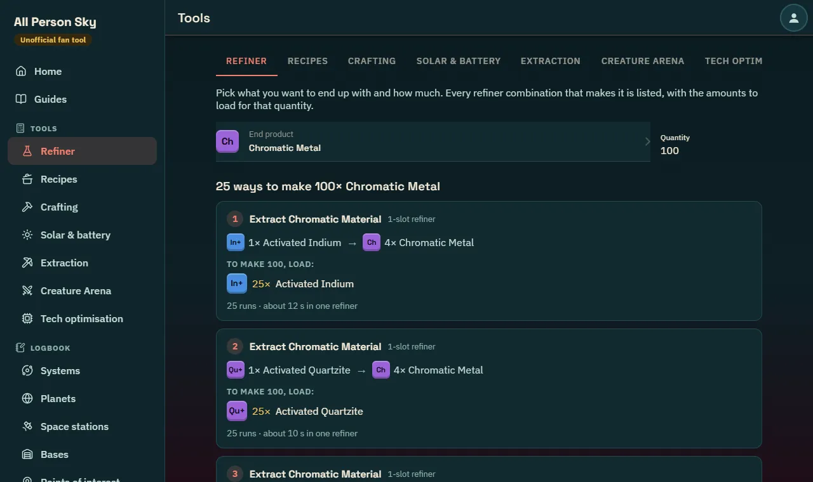
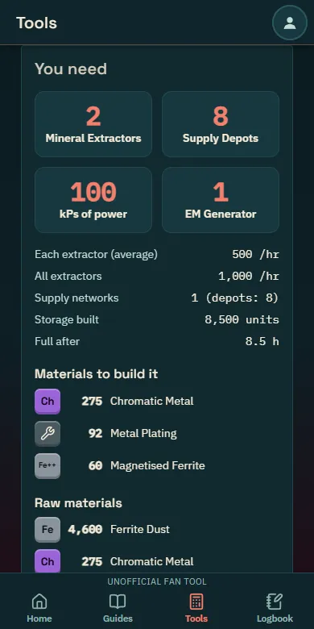
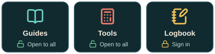
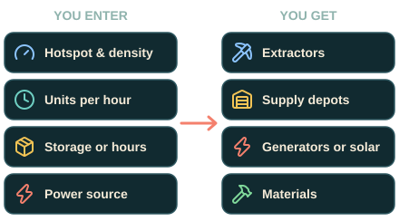
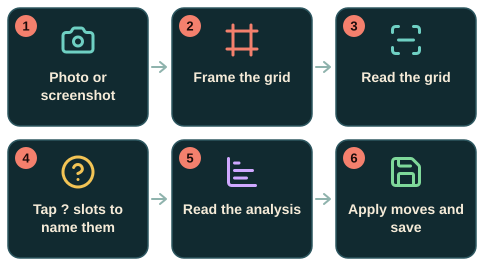
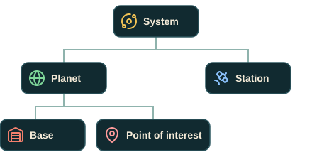
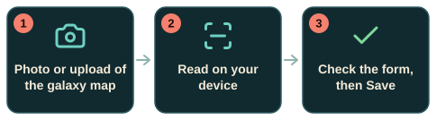
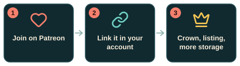
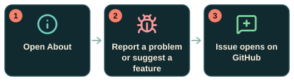

# All Person Sky

**Unofficial No Man's Sky companion:** guides, calculators and a personal logbook for phone, tablet and computer.

  
  

> Unofficial fan tool. No Man's Sky is a trademark of Hello Games; this app is not affiliated with or endorsed by Hello Games.

---

##  Getting started

| | Where |
|---|---|
| **Phone** | Tabs along the bottom |
| **Tablet / computer** | Sidebar: one link per tool and logbook list |
| **Account / Admin** | Avatar at the top right |
| **Language** | Flag at the top right: English, Français, Español (remembered on your account) |

##  Guides

| | |
|---|---|
|  | Pick a section chip, or **All** |
|  | Search: word beginnings match ("refin" → refiner) |

Some guides show only when you're signed in.

##  Tools

| | Tool | What it does |
|---|---|---|
|  | **Refiner** | Every refiner recipe for a product, with amounts and time |
|  | **Recipes** | Cooking: ingredients, material tree, Nutrient Ingestor buff |
|  | **Crafting** | Material tree down to raw materials |
|  | **Solar & battery** | Panels and batteries for your base's power |
|  | **Extraction** | Extractors, depots, power and materials for a mining or gas site |
|  | **Creature Arena** | Best creature types against each opponent |
|  | **Tech optimisation** | Checks your tech grid layout and suggests moves |

Every tab has its own link, so you can bookmark or share it.

###  Extraction

- **Density:** the Survey Device shows it; the hotspot centre is best.
- **Advanced:** 2 extractors per network avoid the slowdown.

###  Tech optimisation

Tabs: Exosuit · Starship · Multi-tool · Freighter · Exocraft

- Icons you name are remembered on this device.
- Mark supercharged slots on ships, tools, exocraft and freighters.
- Undo is always there. Saving needs you to be signed in.

##  Logbook

Private to you; needs you to be signed in.

| | |
|---|---|
|  | **+ New …** on any list; tap a name to open it |
|  | Search, filter, sort (cards on phones, table on computers) |
|  | Stations: record the upgrades each merchant sells |
|  | Points of interest: class, coordinates |
|  | **Screenshot** on any record: its portal glyphs, galaxy and names are read and filled in. It's linked to the planet or system with the same address; a missing one is added for you. Systems also get their region from the galaxy map. It's named from the galaxy map or planet info when the screen shows the name, otherwise from the address: glyph 1 is the planet ("Planet 3"), the next three the system ("System 05E"). The same system is never added twice. The areas it read are marked on the picture: move, resize or delete a box, or add one, and read again |

**Glyphs in photo mode:** take the screenshot with your platform's own capture (for example Steam's F12). The game's camera leaves the glyphs out. Glyphs marked in amber need checking against the picture; corrections are remembered on your device.

###  Scan screen (Systems)

The panel and any glyphs it finds are marked on the picture, as with screenshots: move, resize or delete a box, or add one, and read again. For a game language other than English, choose it in the scan dialog.

##  Account

**Create account** · **Sign in** · **Forgot password?** · **Sign out**. All of these are in the avatar menu at the top right.

**Delete my account** (bottom of the Account page) removes your account, your whole logbook and your screenshots. Type your e-mail address to confirm.

**Install it like an app:** in Chrome or Edge use "Install app"; on an iPhone use Share → "Add to Home Screen". Guides and tools you have opened keep working without a connection, and the app tells you when a new version is ready.

##  Heroes

The app is free, and supporters on Patreon keep it running.

In your account you can hide yourself from the Heroes page or change the name it shows.

##  Feedback

Include the **version and build** shown on the About page. You'll need a free GitHub account. You can also [open an issue](https://github.com/tapaccos2/AllPersonSky/issues) directly.

##  Privacy

| | |
|---|---|
|  | Logbook and saved layouts: only you can see them |
|  | Screen scans and grid photos: read on your device, never uploaded |
|  | Logbook screenshots: read on your device, stored only if you save one |

No ads, no analytics, no tracking cookies. The full policy is the **Privacy** page in the app (About → Privacy policy).

Game data comes from the [No Man's Sky Wiki](https://nomanssky.fandom.com/) (CC BY-SA), with the newest items and charts from [No Man's Sky Resources](https://www.nomansskyresources.com). If something looks wrong after a patch, please report it.

---

*Found a problem or have an idea? [Open an issue](https://github.com/tapaccos2/AllPersonSky/issues) (a free GitHub account is needed).*
